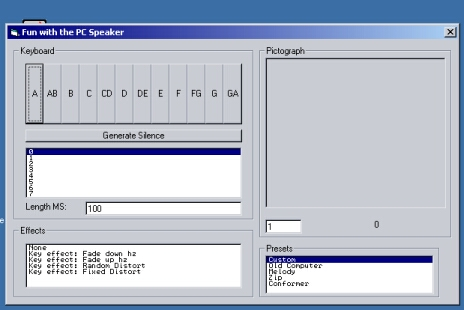



## Fun with the PC speaker

### Description

Shows how to use API to make system speaker beep, distort the beep, Keyboard, and beep according to mouse movements. Later I will add Recording features. The pc speaker is the most universal sound hardware.
 
### More Info
 

             |
---                |---
**Submitted On**   |2001-09-29 00:15:18
**By**             |[Tecc](https://github.com/Planet-Source-Code/PSCIndex/blob/master/ByAuthor/tecc.md)
**Level**          |Beginner
**User Rating**    |4.0 (20 globes from 5 users)
**Compatibility**  |VB 4\.0 \(32\-bit\), VB 5\.0, VB 6\.0
**Category**       |[Miscellaneous](https://github.com/Planet-Source-Code/PSCIndex/blob/master/ByCategory/miscellaneous__1-1.md)
**World**          |[Visual Basic](https://github.com/Planet-Source-Code/PSCIndex/blob/master/ByWorld/visual-basic.md)
**Archive File**   |[Fun with t271469292001\.zip](https://github.com/Planet-Source-Code/tecc-fun-with-the-pc-speaker__1-27633/archive/master.zip)

